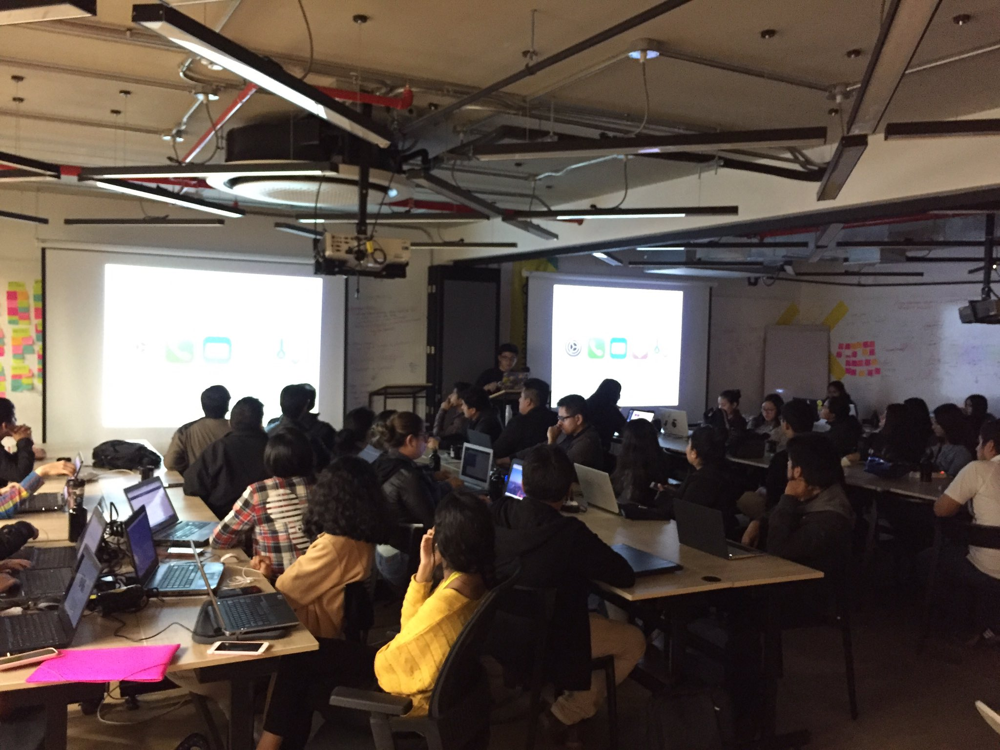
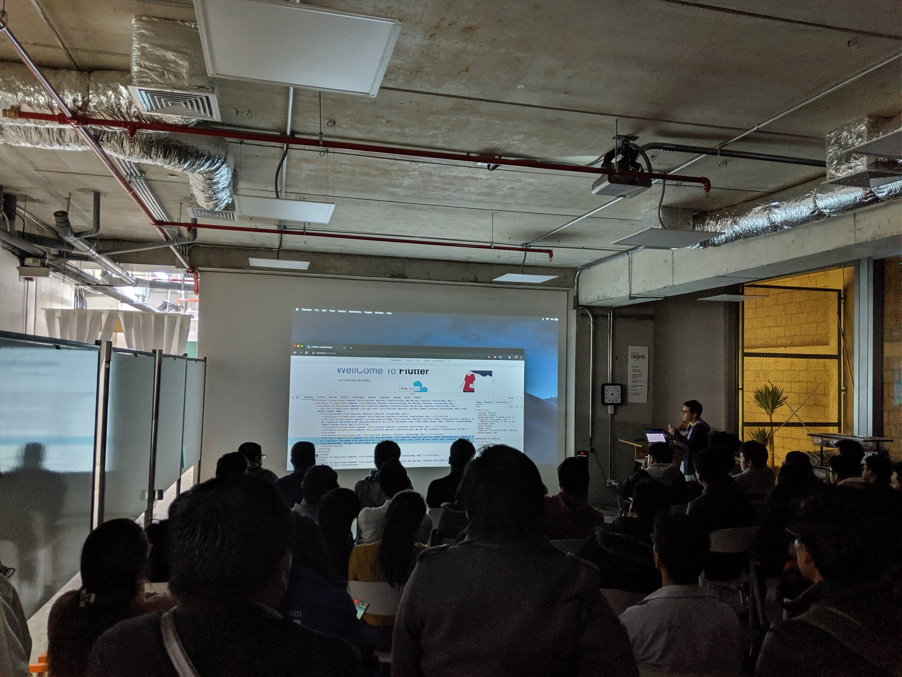
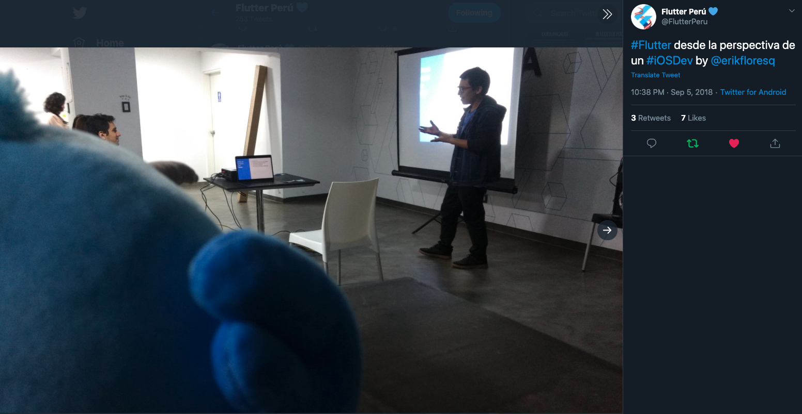

- [erikfloresq@gmail.com](mailto:erikfloresq[AT]gmail[DOT]com)
- Lima, Perú

## Habilidades Técnicas

- **Lenguajes** - Swift, objective-C, JavaScript, HTML, CSS, Bash
- **Conceptos** - RESTful API Integration, CI/CD, Agile, Scrum
- **Herramientas/Plataformas** - Git, Node.js, Jenkins, CLI, Jira
- **Frameworks/Librerias**
  - **Plataformas Apple**

    UIKit, SwiftUI, CoreData, CoreLocation, Alamofire, Rx Swift, Firebase, Moya, UserNotification, UserDefault, TodayExtension, LocalAuthentication, KeyChain, WatchKit, URLSession, PassKit, APN, GoogleTagManager
  - **Web**

    Pug, Sass, Stylus, jQuery, Bootstrap
- **Arquitecturas** - MVC, MVVM
- **Data** - GraphQL, JSON

## Experiencia

#### iOS Developer

**PedidosYa** - _2019 - actualmente | Montevideo_

- Desarrollo de diferentes features que mi squad requiere, entre implementación de interfaces hasta pruebas A/B, para este proyecto, uso tecnologias como UIKit, Moya, Cocoapods

#### iOS Developer

**TektonLabs** - _2019 | Lima_

- Desarrollo de interfaces, el proyecto utiliza patrones como repositorio, MVVM, Reactive cocoa, RX swift, Alamofire.

#### iOS Developer

**UND - Grupo El Comercio** - _2015 - 2019 | Lima_

- Desarrollo de la aplicación para Urbania, que permite visualizar ofertas inmobiliarias a nivel Perú, fue desarrollado en Swift 4.2 con CocoaPods, UIKit, CoreData, APN, Firebase, Google Tag Manager, UserDefaults, IGListKit, GraphQL, Apollo, tiene version para iPad.
- Desarrollo de la aplicación para NeoAuto, que permite la oferta de carros a nivel Perú, fue desarrollado en Swift 4 con CocoaPods, UIKit, UserDefaults, Realm, APN, Firebase, Google Tag Manager, Moya, tiene version para iPad.
- Desarrollo de la aplicación para Aptitus, que permite la oferta y publicación de puestos de trabajo, fue desarrollado en Swift 4 con CocoaPods, UIKit, UserDefaults, CoreData, APN, Firebase, Google Tag Manager, 3D Touch, CoreLocation, Moya, tiene version para iPad.
- Desarrollo de la aplicación para PagoEfectivo, que permite consumir saldos de la tarjeta PagoEfectivo, fue desarrollado en Swift 4 con CocoaPods, UIKit, CoreData, TodayExtension, UserDefaults, CoreData ,KeyChain, CoreLocation ,integración con FaceID, TouchID.
- Desarrollo de la app de Urbania para Apple Watch, que permite visualizar los favoritos y búsquedas guardadas en el iPhone, ademas de poder ver el detalle del aviso y si usamos Fource Touch podremos ver la ubicación del inmueble en el mapa, se uso Swift 3, WatchKit, NSURLSession.

#### iOS Developer

**Clicks and Bricks SAC** - _2015 | Lima_

- Desarrollo de la aplicación para OferTop, que permite visualizar y comprar ofertas diarias con diferentes medios de pago como VISA y PagoEfectivo, se desarrollo usando Objective-C, UIKit, PassKit, UserDefault, AFNetworking.

#### FrontEnd Developer

**UND - Grupo El Comercio** - _2013 - 2014 | Lima_

- Desarrollo del frontend del nuevo portal de Ofertop.pe utilizando pre-procesadores Jade (HTML), Stylus (CSS), Coffeescript (Javascript) y herramientas de automatización de tareas: GruntJs, librerias Jeet y Rupture para media queries.
- Desarrollo del frontend de la web shopin.pe que permite mostrar ofertas de diferentes marcas del medio como ofertop, despegar, avianca, adidas, entre otros se desarrollo usando html 5, css 3 y javascript, ademas tenia soporte para diferentes resoluciones.
- Rediseño total del portal urbania.pe, se utilizaron tecnologías como php, mysql, html, css, javascript (patron modular).
- Rediseño total del portal kotear.pe, se utilizaron tecnologías como php, mysql, html, css, javascript (patron modular).

#### FrontEnd Developer

**SparzaClub** - _2011 - 2012 | Lima_

- Desarrollo de la primera version de la página de sparza club, se utilizaron tecnologías como php, mysql, html, css, javascript usando jquery.

#### IT Trainee

**AstraZeneca Perú** - _2011 | Lima_

- Desarrollo y soporte de aplicaciones web.

#### Practicante Web Developer

**USMP - FIA** - _2009 - 2010 | Lima_

- Desarrollo y soporte de aplicaciones web.

## Charlas

#### [Sketch API powered by JS](https://speakerdeck.com/erikfloresq/sketch-api-powered-by-js)

**LimaJS** - _2019 | Lima_

### Flutter para Web

**Flutter Perú** - _2019 | Lima_

### [Flutter para iOS](https://speakerdeck.com/erikfloresq/flutter-para-ios-developers)

**Flutter Perú** - _2019 | Lima_

### [Fastlane para iOS](https://speakerdeck.com/erikfloresq/fastlane-para-ios)

**Women Tech Maker** - _2018 | Lima_

### [Desarrollando para WatchOS](https://speakerdeck.com/erikfloresq/desarrollando-para-watchos-1)

**Mobile Developer Talks** - _2018 | Lima_

### [PebbleJS](https://speakerdeck.com/erikfloresq/pebble-js)

[Youtube](https://www.youtube.com/watch?v=u6vdD00Ez1o)

**LimaJS** - _2015 | Lima_

## Educación

#### Ingeniero en Computación y Sistemas

**Universidad de San Martin de Porres** - _2006 - 2012 | Lima_
  