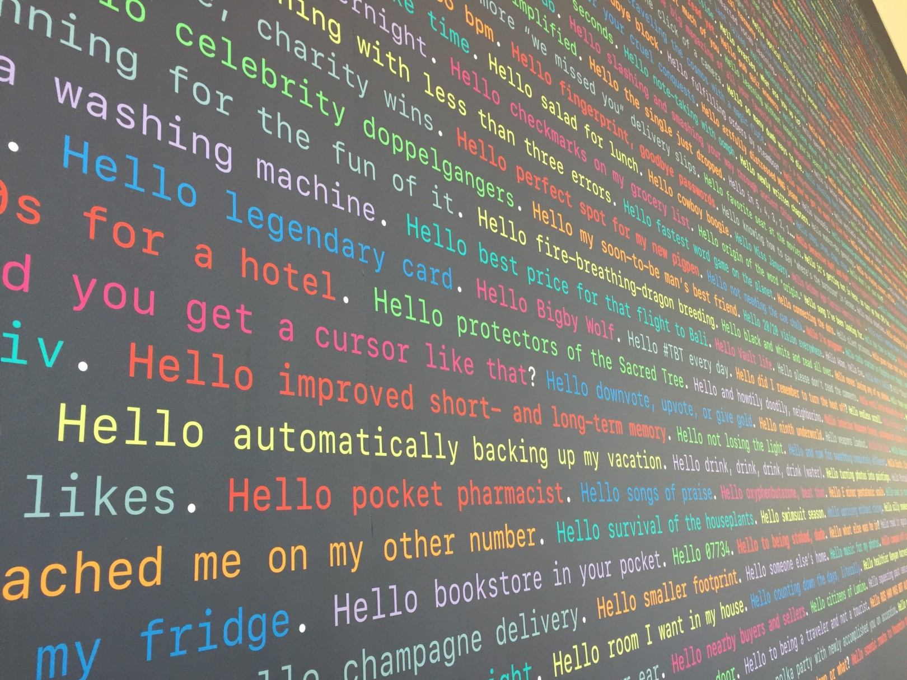

### Un día random del 2015, viendo el WWDC 15

**Yo:** Bueno y quien quita que un día vayamos y estemos viendo a Craig Federighi presentando el futuro de iOS.
**Luis:** jajaja bueno si, quien sabe.

### 18 de Abril del 2016

**Luis:** Erik, acabo de mandar mis datos para entrar a la lotería del WWDC, no te olvides de mandar tus datos.
**Yo:** 😱 , está bien, en un rato lo hago, ¿Porque lo haré, no? 🤔 .

### 22 de Abril del 2016, por la mañana

**Yo:** Bueno, hoy es el último día de la inscripción, la verdad no tengo nada que perder, somos miles y miles de programadores en el mundo que mandaremos nuestra solicitud y seriamos muy suertudos que los dos ganemos, pero :
- ¿Si solo gana Luis?, la verdad es que me alegraría mucho por él, nos traerá muchas fotos y recuerdos.
- ¿Y, si solo gano yo?, la verdad es que me 💩 de miedo, nunca he ido a Estados Unidos y mucho menos tengo VISA, pero Luis tampoco tiene 🤔 VISA y bueno, ni si quiera hemos calculado los gastos que todo esto implica, pero si tuvo el valor de hacer click, por algo será ¿no?, a aparte, mi suerte anda de mal en peor, así que ¿por qué no? (ese fue el ¿por qué no? más YOLO de mi vida, porque para hacer la inscripción había que poner una tarjeta de crédito y en la caso de que “seas suertudo” te iban a debitar la módica suma de $ 1599 (en serio apple ese dolar que falto para completar los $ 1600 lo tengo guardado en mi billetera)
Bueno ya, porque la pienso tanto, aparte ir a un WWDC e ir a San Francisco esta en mi lista de cosas por hacer antes de morir, mataría dos pájaros de un tiro.
En ese instante hice el click más importante de mi 2016.

### 22 de abril del 2016, por la noche

— Erik, ¿puedes revisar el saldo de tu tarjeta? — me escribe Luis por iMessage.
— Esta bien — le respondí por el Apple Watch.
— Me acaban de debitar $1599 , creo que gane ya tengo mi ticket para el evento— me vuelve a escribir Luis.
En ese momento vi que a mi cuenta le faltaba $ 1599.
— Luis, a mi también me falta $ 1599, ¿ chocatela ? ✋🏼 — le escribi temblando (para los que no sepán que es “chocatela” es como un “Dame esos 5”).
— Werik, ¡nos vamos a San Francisco !— me respondió Luis (Werik es como me dicen mis amigos y aveces hasta gente que ni conozco).
Y en ese momento me llego el correo que lo reconfirmaba.

### 25 de Abril del 2016, en el trabajo 

Bueno ya habíamos asimilado la idea que teníamos nuestro ticket comprado, que debíamos armar un presupuesto para el viaje y que no teníamos VISA para viajar a Estados Unidos (esa era la mejor parte).
**Yo:** Bueno Luis, voy armando mi solicitud para la VISA.
**Luis:** Cierto yo también lo haré en un rato.
**Yo:** Si nos niegan la VISA, bueno fue bonito ir al WWDC de sentimiento no más, pero igual acabamos de ganar el privilegio de comprar una entrada de $ 1599 así que estamos de suerte 😀.

### Sacando la VISA

Yo envié primero mi solicitud para la VISA y me citaron para dentro de 10 días, cuando Luis hizo la solicitud no había entrevistas hasta dentro de 30 días (recuerden, no teníamos mucho tiempo, el evento era en junio, nos faltaba comprar pasajes y alquilar un lugar para vivir y como haces todo eso si no sabes si vas a poder viajar por falta de VISA), lo bueno es que Luis volvió a revisar el calendario de citas y logro reservar un cita a los dos días, nos le dije que estábamos con suerte o bendecidos por Steve Jobs, una de dos o los dos también.
Luis fue a su entrevista, le hicieron unas cuantas preguntas y le dieron la VISA 🎉, mi caso fue todo lo contrario, pero ya me había mentalizado para lo bueno y lo malo.

**Persona muy seria de la embajada:** ¿Para que va a Estados Unidos?
**Yo muy serio:** Para una conferencia de Tecnología.
**Persona seria de la embajada:** Ok, su visa a sido aprobada.
**Yo muy extrañado:** ¿Qué? y donde quedo todas esas preguntas arduas que todos mis amigos me contaron, ¿Acaso soy tan aburrido que la persona de la embajada no quiere enterarse de mi vida?, que más da, ¡Nos vamos a San Francisco! 🎉

### Planeando el viaje

Compramos los pasajes por Expedia (Expedia si estas leyendo esto, si quieres me puedes auspiciar) y fue una muy buena experiencia, el alojamiento lo conseguimos por Airbnb (los mismo va para ti Airbnb, si quiere me puedes dar créditos) y tuvimos mucha suerte de conseguir algo bueno.

### Esperando el Keynote

Se nos aviso que deberíamos ir un día antes al Bill Graham Auditorium( que es donde se daría la Keynote por cierto) para hacer el ChekIn de rigor, ese día nos dieron un casaca del evento y la identificación del evento donde esta tu nombre y en el caso que hayas usado una cuenta de empresa, decía el nombre de la empresa, que fue mi caso.

Ese día le preguntamos a una señorita muy amable sobre como era el tema de las colas para entrar al keynote.

**Señorita de Apple:** Oh bueno, por eventos pasados te puede decir que la gente hace cola desde muy temprano.
**Nosotros:** ¿Que tan temprano?
**Señorita de Apple:** Desde la madrugada.
**Nosotros:** ¿ 6am ?
**Señorita de Apple:** Hasta mucho antes.
**Nosotros:** 😱 (mismo Mi Pobre Angelito).
Como nos gano la incertidumbre, decidimos ir a las 4am :)

Hacia mucho, pero mucho frío y se venia la hora del desayuno, vi que mucha gente venia con vasitos de Starbucks, y fue la primera vez que vi que un Starbucks abría desde la 5am o hasta antes creo, el punto de esto es que muchas empresas (ajenas a apple) no desaprovechaban la oportunidad para invitar café con publicidad sobre meetups que iba a ofrecer, eso me pareció simplemente ¡genial!

Al final Apple ofreció desayuno para todos 🎉

Las horas iban pasando y empece a ver como la gente iba llegando, y es ahí donde me acorde que es un evento oficial de apple y que esto esta lleno de miles de iOS developers de todas partes del mundo, fue así que me encontré con Ricardo quien fue quien me dicto mi curso de iOS en Lima.

Las horas estaban pasando y ya estábamos ¡listos!

Para mi, era todo nuevo, ver toda esa organización, ver a mucha gente apasionada por la misma tecnología que tú, que más podía pedir. (Quizás mas café, ¡hey!, estaba desde las 4am ahí).

El Keynote fue una gran experiencia, porque una cosa es verla en tu casa y otra es ver como los developers que están a tu al rededor comentan y hasta se emocionan por nuevas características del sistema operativo.

### Asistiendo a los talleres

El keynote había sido genial, aun no lo asimilaba, nosotros no habíamos encontramos hospedaje en San Francisco, así que tuvimos que buscar hospedaje un poco lejos de San Francisco, eso nos obligo a aprender a usar el BART y el Muni.

Cuando doble la calle y vi el Moscone Center con toda la decoración del WWDC, se me escarapelo el cuerpo (mi fanboy se estaba activando).

Llegamos temprano y aprovechamos para tomar el desayuno que te ofrece Apple.

Vieron que en la foto anterior, hay un cable de red, ¿Lo vieron no?
Pues aparte de tomar desayuno era una “zona de descargas” para obtener las versiones beta de lo que se había anunciado ayer en el keynote (iOS, macOS, tvOS, watchOS, xcode, entre otros), el punto es que estos software no es que pesen megas, ¡pesan gigas!, fue ahí donde me acorde cuando estaba en mi casa y como me demoraba horas y horas en descargar los beta, pero hahahaha, me olvide que esta en un WWDC. 
Lo primero que baje fue el xcode que pesa entre sus 3GB o 4GB y bajo en ¡3min!, lo primero que pensé es que quizas habia bajado mal, pero cuando vi que estaban las 3.yTantoGB en mi maquina, me pregunte, ¿Cuanto es la velocidad de descarga?

Bueno una vez que tienes todas la betas es hora de ir a las charlas y aprender sobre el futuro de iOS, pero antes de todo vi este panel que me hizo mucha gracia y que en verdad es buen resumen del WWDC.

Lo bueno de ir acompañado es que puedes repartirte la asistencia a las charlas, en el caso que no llegues a una, las encontraras luego la web.

### Apple Design Awards

Los Apple Design Awards es como los Oscars del mundo Apple y es una de las partes que más me gusta de los WWDC, porque aquí se muestran lo mejor de mejor en el desarrollo usando tecnología Apple, la sensación con la que terminas después de ver todos estos premios, es que el limite se lo pone uno mismo.

### Conociendo Gente

Al estar en estos eventos es inevitable conocer gente, fue a si que conocimos a Raúl, un trabajador de Apple, que era quien se encarga de ver las aplicaciones que se hacen en latinoamérica, de impulsarlas y llevarlas a otro nivel, el nos invito a una reunión, donde nos reuniríamos todos los developers por regiones (Europa, Asia, Norte America, Latinoamérica y así) cada región tenia un representante, Raúl era el representante de mi región y fue así como conocí gente de Argentina, Brasil, Guatemala, México y hasta de Perú, hahahaha si de mi mismo país (¡saludos Laura!), fue simplemente genial.

En ese interin de conversar vimos pasar a un señor con una camisa con un logo que para los que consumimos juegos en iOS es sinónimo de genialidad y era Bagrat Dabaghyan, miembro del equipo de Shadowmatic (lider técnico y ganador de un Apple Design Awards para ser exacto y si no sabes que es shadowmatic, pues deberías ir a buscarlo en el Appstore en este momento, ya después puedes terminar de leer mi historia, no te vas a arrepentir). Luis y yo quedamos alucinados con su historia de como desarrollo el juego, fue lo mejor del día, no les miento.

### Lo que sucede en el WWDC se queda en el WWDC

Eso era lo que decía la pulsera para entrar a la fiesta ofrecida por Apple para los asistentes al WWDC, así que por ese motivo no contare más en esta parte, quizás que llevaron a Good Charlotte, pero no diré más 🙈.

### Turismo Geek

Cuando armamos nuestro plan para el viaje habíamos definido que de todas maneras ibamos a hacer el tour geek, cueste lo que nos cueste, fue por ese motivo que alquilamos un carro y recorrimos todo Silicon Valley y entre otras cosas bonitas que ofrece San Francisco.

### En Resumen

Si no hubiese hecho ese click para mandar mi solicitud para obtener un ticket al WWDC, nada de lo que les mostré anteriormente hubiese pasado. Aveces creemos que hay cosas que tenemos que hacer en un futuro muy lejano porque simplemente no estamos listos, pero al final, saben que, yo creo que siempre estamos listos para hacerlo todo.